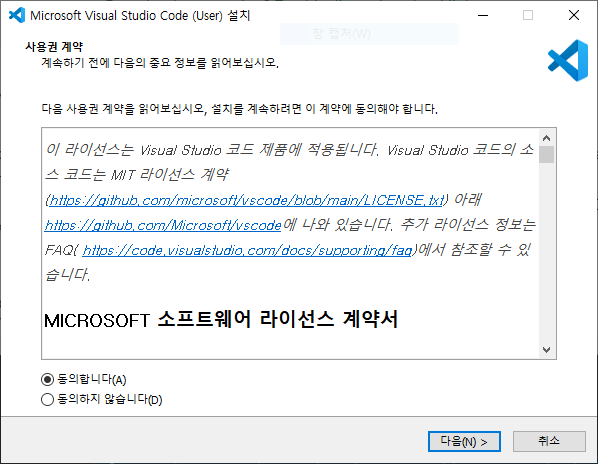
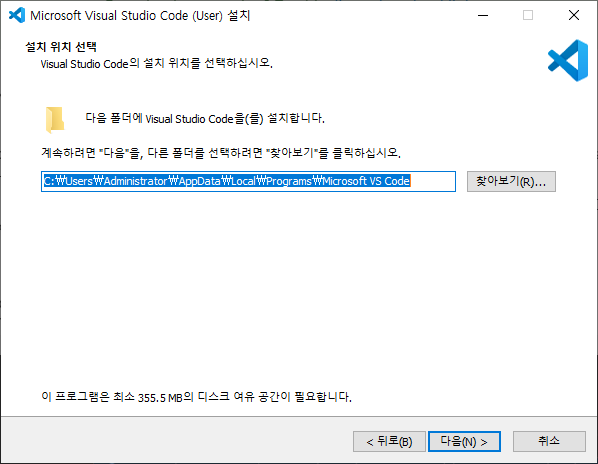
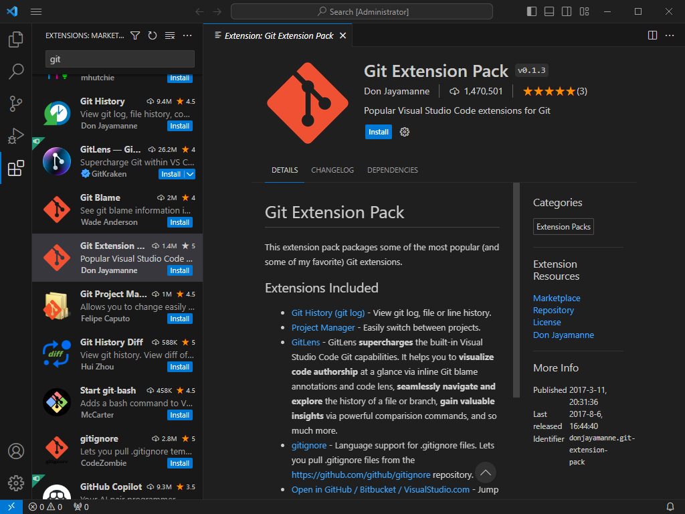
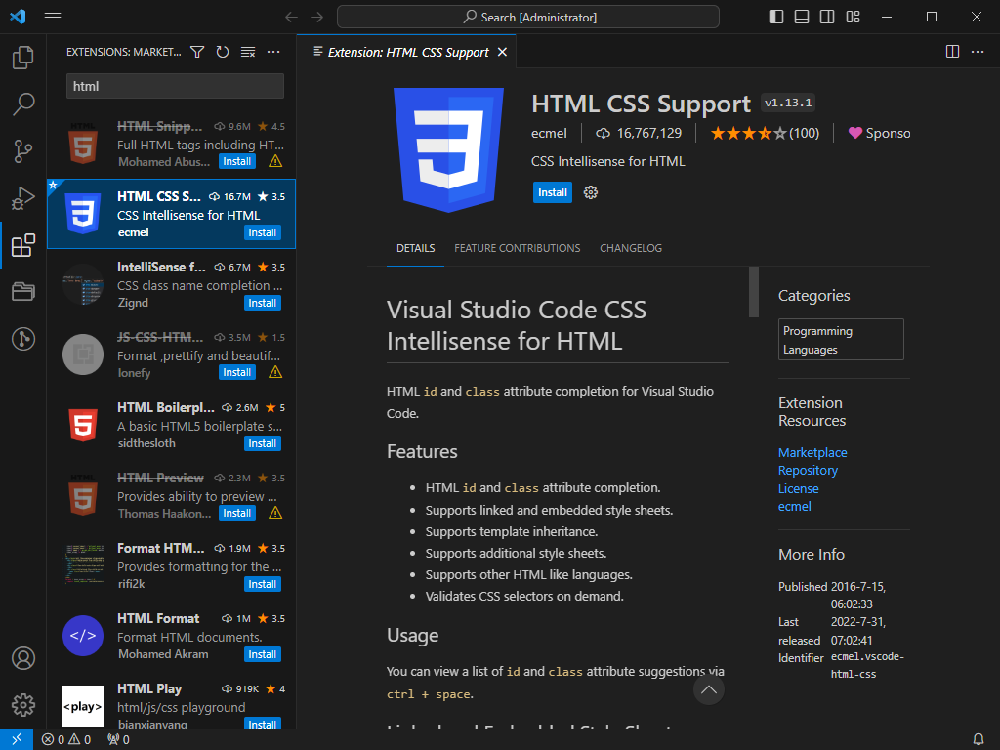
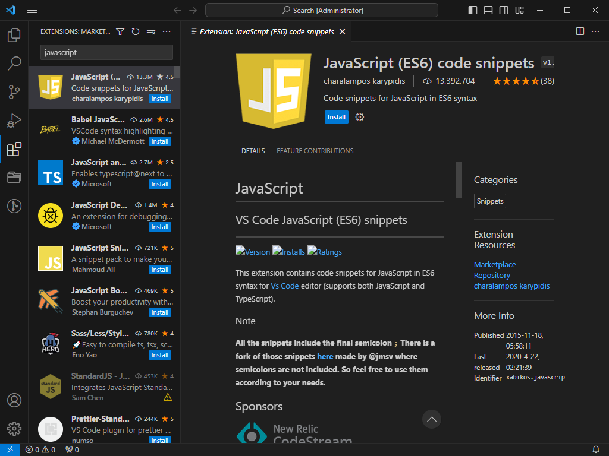
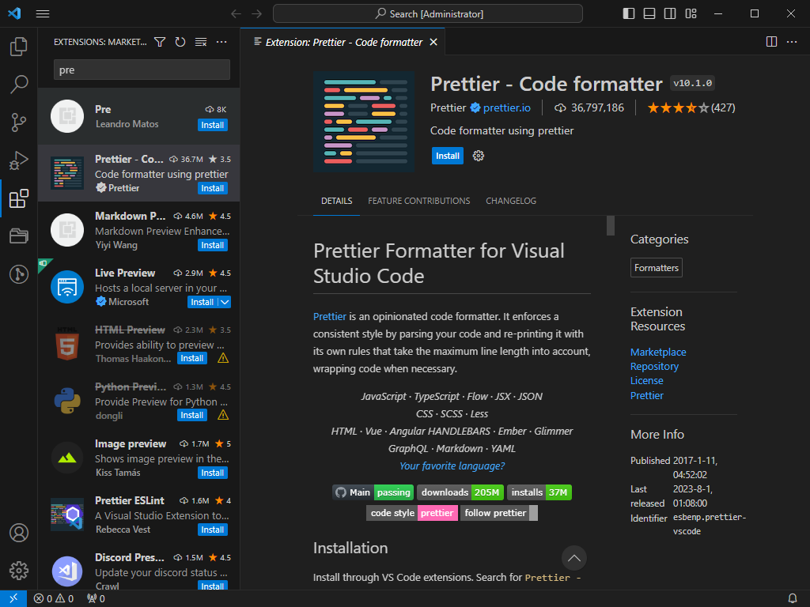

# Visual Studio Code Setting

웹 페이지는 브라우저 위에서 돌아가므로 별도의 오브젝트 파일이나 실행파일을 필요로 하지 않습니다. 따라서 단순 텍스트 에디터, 혹은 웹브라우저 바로 위에서 코드를 작성하여도 무방합니다.

하지만, 우리는 조금 더 편리한 프로그래밍을 위해 사람들에게 가장 많이 보편적으로 사용되는 `Visual Studio Code`를 사용할 것입니다.

`Visual Studio Code`는 기존의 "기초 프로그래밍", "고급 프로그래밍", "응용 프로그래밍"에서 사용하던 Visual Studio와는 다른 프로그램으로, 해당 프로그램은 IDLE을 제공하는 것이 아니라, 단순히 코드 작성을 편하게 해주는 텍스트 에디터로서의 성격을 지니고 있습니다. 

하지만 여러 “텍스트 에디터”의 성격을 지니고 있으므로서 오히려 프로젝트의 생성이 더 가벼워지고, 다른 개발환경과의 통합을 사용자가 원하는 대로 가져갈 수 있어, 특히 웹 프로그래밍이나 파이썬 프로그래밍 등의 인터프리터 기반 작업에 많이 사용되고 있습니다.

아래는  Visual Studio Code (이하 VSCode)의 세팅에 대해 기술합니다.

1. VSCode 설치
    
    [https://code.visualstudio.com/Download](https://code.visualstudio.com/Download)
    
     위의 링크에서 본인의 OS와 알맞는 버전의 설치파일을 내려받습니다.
    
    
    
    
    
    약관에 동의하고, 설치 위치를 선택 후 다음을 계속 눌러 설치를 마칩니다.

     

2. VSCode Extension
    
    아래의 이미지에 보이는 세가지 extension을 설치합니다. extension은 꼭 필요한 것은 아니지만, 앞으로의 코드 작성에 있어, 자동완성이나 부가 단축키 등의 편리한 기능을 제공합니다.
    
    - Git Extension Pack
        
        
        
        `git`의 사용을 좀 더 편하게 할 수 있는 확장팩의 모음집입니다.
        
    
    - HTML CSS Support
        
        
        
        HTML및 CSS 보조 확장입니다. 속성 이름 추천 및 자동완성을 지원합니다.
        
    - JavaScript (ES6) code snippets
        
        
        
        JS 스크립트의 작성을 보조합니다. 최신 문법인 ES6까지 지원합니다.
        
    
    - Prettier - Code formatter
        
        
        
        코드의 들여 쓰기를 보조합니다. 손쉽게 예쁜 들여쓰기를 할 수 있습니다.
        
    - Live Server
        
        
        웹 페이지 렌더링을 위한 임시서버를 생성합니다. 페이지나 스크립트를 수정하면, 즉각적으로 웹페이지의 변화를 확인할 수 있습니다.

     
    이 외에도, 편해 보이는 확장이 있으면 추가적으로 설치하여 쓰시면 됩니다.